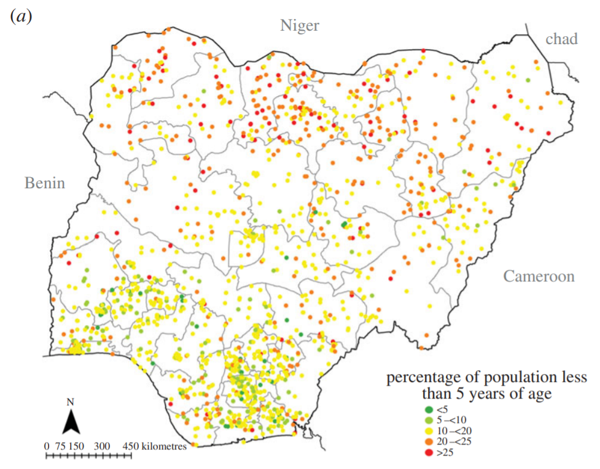

Methodology Paper

Andrew Protiva

# The Use of the Bayesian Model for Improvement of Health Outcomes in LMICs

Good health and well being is the third sustainable development goal as stated by the United Nations. Good health is essential for low-middle income countries in order for them to develop efficiently and quickly. Why is this? Is development possible with poor health? The answer is yes, development is possible with poor health, but health and health systems are essential for long term improvements of the complex system as a whole. Poor health causes many tangible harms to individuals, even those not directly afflicted by poor health. Societal capabilities are decreased when an individual is affected by poor health. This cascades to close family, who may have decreased capability due having to take care of the one in poor health or having to pay for treatment. All of these decreases in capabilities eventually lead to decreased societal opportunities. Societal opportunities and capabilities are essential for development. Without them, people would not be able to extend their own real freedoms effectively. Many specific elements are involved with healthcare such as equipment, accessibility, effectiveness, cost, and many more. Healthcare systems are also very complex, thus many developing countries are looking to analyze data in order to create a more elaborate, specific, and effective policies for health systems. Some of my main questions I considered were how effectively does Tajikistan use its data for health systems, and the overall power of predictive health modeling using the Bayesian Method. In simple terms, the Bayesian Method produces a probability of an event based on prior knowledge. This investigation is largely evaluative, as my central questions are based on understanding how the real applications of health data are both practically implemented, as well as theoretically implemented. When looking at development of methods or countries, it is important to consider that nothing is perfect. Comparatively evaluating real implementations as well as theoretical possibilities is important in fully evaluating the entire picture of health data usage. Other questions may be considered as well. What methodology would be most effective to analyze existing data in order to provide useful information about rural health facilities? What are the significant gaps of the Bayesian method that limit its use in health data?

The Bayesian Method is used in a variety of contexts, one of which is in a paper by Alegana et al. This study sought to generate a fine resolution map of age-density in Nigeria. A two stage process was used in order to do this. The first stage was to select covariates that would be used to predict data in areas without already existing survey data, and the second stage was to model the map using a Bayesian approach. The covariates were selected using a different method, but were optimized for use in the Bayesian approach. Using R, the leap algorithm was implemented in order to determine the covariates best fit for the Bayesian method. Existing data compiled from DHS, MIS, and LSMS-AIS were used as initial data for this study, below is a visual representation of this data. 
 
 
 
By using this data in combination with covariate information, the Bayesian Method will create a full representation of population density with 1km x 1km grid cells. The Bayesian Method is a geostatistical approach that uses relationships to covariates to generate data with higher precision, while also generating the uncertainty of this data. Every observation is a random function Zu of space u. The random function Zu can have outcomes that relate to a different locations in space based on a function of Euclidean distance. This causes the outcome of Zu to be based on distances to other spaces, and vice versa. In addition, this model is spaciotemporal, meaning it includes time as an aspect of the function, resulting in the random function Z(s, t). This random function determines the conditional probability of population distribution based on the spatial and temporal inputs. By using data from known cluster centroid locations in combination with date and the selected set of covariates, stochastic partial differential equations result in a Bayesian hierarchical spatio-temporal model. The basis representation of the stochastic partial differential equations is (Image Malfuntion, with  (Image Malfuntion), a product of the spatial and temporal basis function. 

(Image Malfunction)

This generates a precision matrix of form  where (Image Malfunction) is the precision in the spatial domain and (Image Malfunction) in temporal domain. Through this Bayesian Model, the researchers were able to produce continuous maps of the estimated proportion of the population that is under 5 years old at a 1km x 1km grid size in Nigeria. 

Zhong and Xiao use the Bayesian Method in a different way. They use the Bayesian method to conduct information fusing. This is a step implemented in creating an framework for deep learning. The consolidation of different health information sources reduces uncertainty and allows for better understanding of data. Bayesian inference results in a level of fitness for a probability distribution accounting for both observed and unobserved data. 

(Image Malfunction)

The full process has four steps. Every data source yields a hypothesis, which is used in the function 𝑃(𝐻k | 𝑂i) where Hk is the probability of the type of each entity, and Oi is the actual entity from the data source. The probabilities are combined based on Bayes’ Rule, 𝑃 (𝐻|𝐸) = 𝑃 (𝐻, 𝐸) / 𝑃 (𝐸). Constraints are factored in through decision logic, and a Fused Identity Oi is produced. The Bayesian Method is a small part of the whole conceptual framework for deep learning using eHealth data, but it is important nonetheless. In addition, a Bayesian network is used to create a joint probability model of nodes and edges in order to account for dependencies between variables.
  
 (Image Malfunction)
  
U is the set of random variables of interest, Pa(Xi) is the parental variables of variable Xi. All of this provides information fusion, which compiles and condenses relevant information. In the broad scope of the paper, the Bayesian method is simply used as a stepping stool to attain the final result of analyzing health data using deep learning. 

The Bayesian Model is a powerful prediction tool that can be used in a variety of situations, and new implementations are being created and used frequently. One of the most important considerations to address is the limitations of this model. This model certainly has shortcoming and is not viable for every situation. These limitations are the most important in determining future research in this area. An area that I believe is lacking is interpretation of results. The Bayesian method is very powerful in prediction as well as confidence, but prediction and confidence do not represent the true landscape of the data. Further research will need to be conducted on significantly unconfident data and problems that can arise from it. 

Alegana VA, Atkinson PM, Pezzulo C, Sorichetta A, Weiss D, Bird T, Erbach-Schoenberg E, Tatem AJ. 2015 Fine resolution mapping of population age-structures for health and development applications. J. R. Soc. Interface 12: 20150073. http://dx.doi.org/10.1098/rsif.2015.0073

Zhong H, Xiao J. Enhancing Health Risk Prediction with Deep Learning on Big Data and Revised Fusion Node Paradigm. Scientific Programming. June 2017:1-18. doi:10.1155/2017/1901876.

